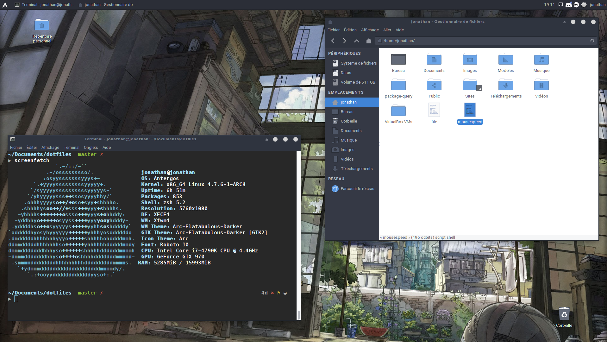
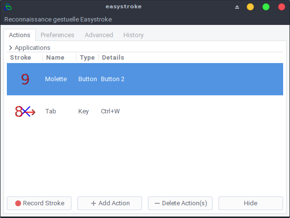

# A propos

Ce dépôt est une bouée de sauvetage en cas de formatage et me permet de noter les choses à savoir concernant mon installation de Linux.

[](https://raw.githubusercontent.com/Grafikart/dotfiles/master/screenshot.png)

La liste des paquets installés sur ma machine sont disponibles dans le fichier package.list. Les paquets AUR sont en fin de liste

```
cat package.list | xargs yaourt -S --needed --noconfirm
```

# Trucs & Astuces

## Thêmes

- [Duckduckgo](https://duckduckgo.com/?kae=d&kao=-1&kau=-1&kak=-1&kax=-1&k5=1&kap=-1&kaq=-1&kah=ca-en%2Cbe-nl&kl=wt-wt&k7=1a1b26&kaa=BB9AF7&kj=16161e&k21=16161E&k18=-1&kx=1abc9c&kt=e&ka=e&k9=C0CAF5&k8=6183BB)
- [PHPStorm](https://github.com/Grafikart/tokyo-night-jetbrains-theme)
- [VScode](https://github.com/enkia/tokyo-night-vscode-theme)

## Nvidia problems

### LightDM démarre avant nvidia

Source : https://endeavouros.com/docs/hardware-and-network/graphic-cards-gpu-driver-and-setup/nvidia/nvidia-optional-enhancements-and-troubleshooting/

On commence par forcer le modeset au niveau du grub en éditant `/etc/default/grub` et en ajoutant `nvidia-drm.modeset=1` dans la partie `GRUB_CMDLINE_LINUX_DEFAULT`

```
# GRUB boot loader configuration

GRUB_DEFAULT=0 GRUB_TIMEOUT=5

GRUB_DISTRIBUTOR="EndeavourOS"

GRUB_CMDLINE_LINUX_DEFAULT="nvidia-drm.modeset=1 resume=UUID=
```

On reconstruit grub après coup

```bash
sudo grub-mkconfig -o /boot/grub/grub.cfg
```

On force ensuite le early load KMS en modifiant `/etc/mkinitcpio.conf`

```
# vim:set ft=sh
# MODULES
# The following modules are loaded before any boot hooks are
# run. Advanced users may wish to specify all system modules
# in this array. For instance:
# MODULES="piix ide_disk reiserfs"

MODULES="nvidia"

# BINARIES ....
```

On reconstruit ensuite l'image du kernel

```bash
sudo mkinitcpio -P
```

Et on reboot !

### Tearing

- Utiliser nvidia settings pour gérer les settings
- Exporter la configuration et ajouter  `{ ForceCompositionPipeline = On }` dans la partie metamodes de "Screen"

## Remapper les boutons de la souris

[](https://raw.githubusercontent.com/Grafikart/dotfiles/master/screenshots/easystroke.png)

## Remapper touches du clavier

Pour remplacer une touche par une autre. Je l'utilise pour remplacer la touche puissance 2 par un back-tick.

```
# On génère le fichier de map
xmodmap -pke > ~/.Xmodmap
# On trouve la clef a remap
xev | awk -F'[ )]+' '/^KeyPress/ { a[NR+2] } NR in a { printf "%-3s %s\n", $5, $8 }'
# On modifie le fichier Xmodmap et on teste avec
xmodmap ~/.Xmodmap
```

## Trouver le process qui utilise un port

```
sudo netstat -nlp | grep :80
```

## Chemin à connaitre

- `~/.config/mimeapps.list`, association de fichiers
- `/usr/share/applications/`, localisation des `.desktop`
