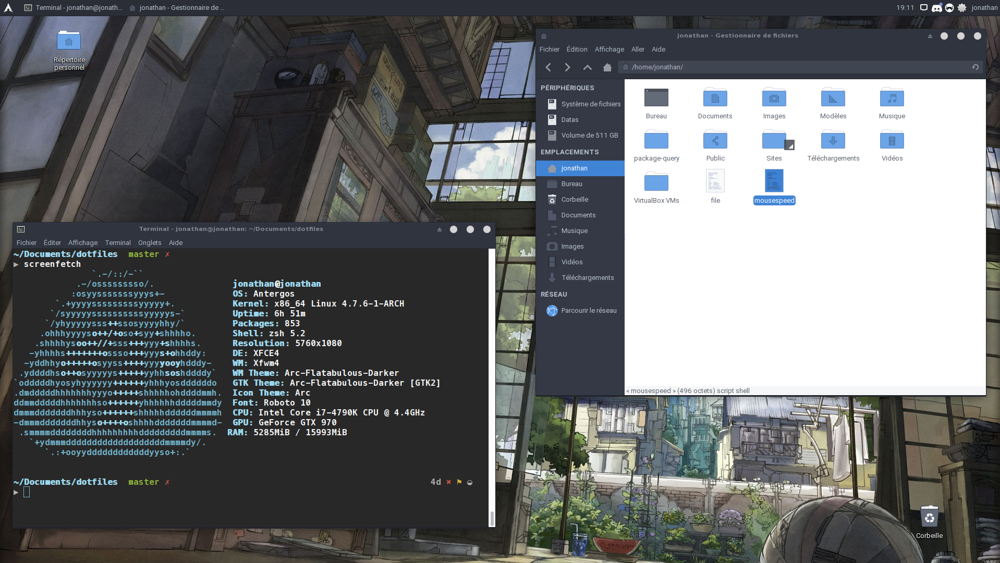

# A propos

Ce dépôt est une bouée de sauvetage en cas de formatage et me permet de noter les choses à savoir concernant mon installation de Linux.

[](https://raw.githubusercontent.com/Grafikart/dotfiles/master/screenshot.png)

La liste des paquets installés sur ma machine sont disponibles dans le fichier package.list. Les paquets AUR sont en fin de liste

```
cat package.list | xargs yaourt -S --needed --noconfirm
```

# Trucs & Astuces

## Chemin à connaitre

- `~/.config/mimeapps.list`, association de fichiers
- `/usr/share/applications/`, localisation des `.desktop`
